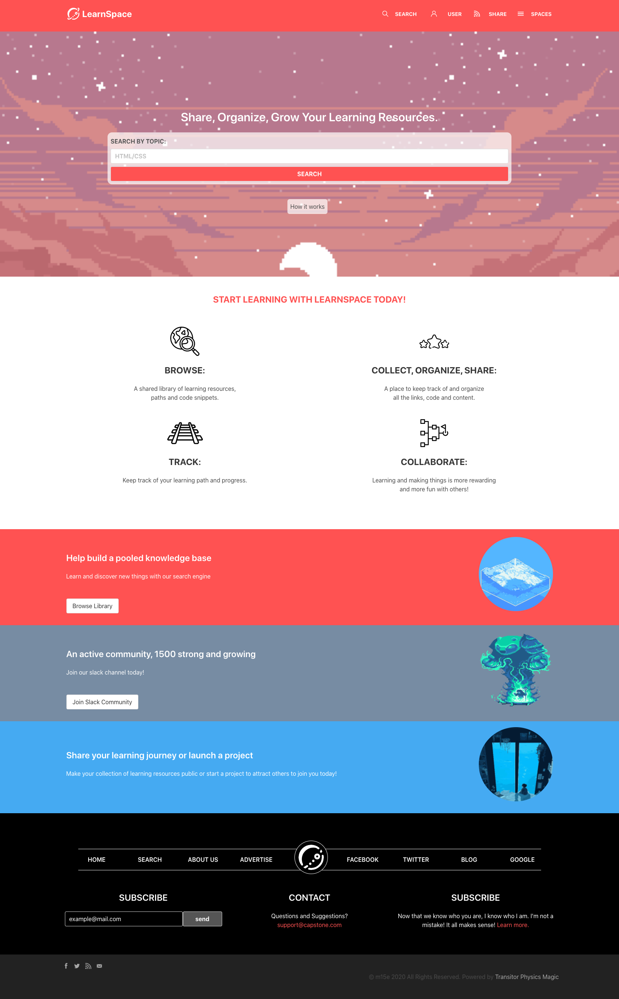

# Microverse HTML/CSS Capstone Project

> The goal of this project was to follow the design style of [PatashuleKE](https://www.behance.net/gallery/25563385/PatashuleKE) by [Mathew Njuguna](https://www.behance.net/mathewnjuguna) and [Sam Achola](https://www.behance.net/aweSam) and customize the design content in order to demonstrate HTML/CSS knowledge.

## Built With

- HTML
- CSS
- SASS
- BULMA https://bulma.io/

## Live Demo

[Live Demo Link](https://epic-wozniak-4c8300.netlify.app)

## Getting Started

**Clone this Repository to your local machine and open the file with your favourite browser that doesn't start with Internet Explorer.**

## Authors

👤 **Mark Rode**

- Github: [@m15e](https://github.com/m15e)

## 🤝 Contributing

Contributions, issues and feature requests are welcome!

Be on the lookout on this github account for the LearnSpace repository.

## Show your support

Give a ⭐️ if you like this project!

## Acknowledgments

- [bulma.io](https://bulma.io)
- [Mathew Njuguna (Design)](https://www.behance.net/mathewnjuguna)  
- [Sam Achola (Design)](https://www.behance.net/aweSam)
- [WANEELA for the great artwork](www.patreon.com/waneella)
- [WANEELA TUMBLR](https://waneella.tumblr.com/)
- [Microverse](https://microverse.org)

## 📝 License

This project is [MIT](lic.url) licensed.